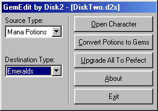



## Diablo 2 GemEdit Source

### Description

This is another program I wrote for Diablo 2. It converts any mana or health potion to a gem of your choice. It can also upgrade gems to perfect. This is only a start. The method used can be applied to other cheats.
 
### More Info
 

             |
---                |---
**Submitted On**   |2000-07-28 16:33:50
**By**             |[Will Brendel](https://github.com/Planet-Source-Code/PSCIndex/blob/master/ByAuthor/will-brendel.md)
**Level**          |Intermediate
**User Rating**    |4.0 (20 globes from 5 users)
**Compatibility**  |VB 4\.0 \(32\-bit\), VB 5\.0, VB 6\.0
**Category**       |[Miscellaneous](https://github.com/Planet-Source-Code/PSCIndex/blob/master/ByCategory/miscellaneous__1-1.md)
**World**          |[Visual Basic](https://github.com/Planet-Source-Code/PSCIndex/blob/master/ByWorld/visual-basic.md)
**Archive File**   |[CODE\_UPLOAD83217292000\.zip](https://github.com/Planet-Source-Code/will-brendel-diablo-2-gemedit-source__1-10184/archive/master.zip)

